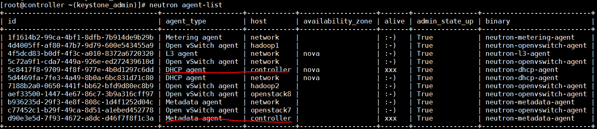

Openstack环境故障总结
=====

- ## 部署虚拟机失败，提示绑定端口失败
原因：nova show命令查看该虚拟机，提示“绑定端口失败，需查看neutron日志”，ssh登录对应的compute节点，日志`openvswitch-agent.log`提示连接消息服务器`127.0.0.1`失败，但实际消息服务器地址应为`10.16.9.89`。至此原因查明：该compute节点重装了Nova和neutron后，只恢复了Nova的配置文件，但没有恢复neutron的配置文件，neutron服务使用的是默认配置，故而出错。

- ## 部署虚拟机成功，从Openstack界面可看到已给该虚拟机分配IP，但虚拟机启动后内部查看无IP地址
原因： 登录controller、network以及compute节点，分别查看日志，没有发现断言等异常信息，且network节点查看`/var/log/neutron/dhcp-agent.log`，发现其在虚拟机启动时没有产生任何日志。使用`neutron agent-list`查看各节点的网络组件的状态，发现多出一个dhcp服务，运行于control节点，如图：注：截图是openstack正常运行时的状态，agent状态`xxx`表示该agent停止运行，当时定位问题时，图中所有状态都是`:-)`，即正常运行。
再来学习[Neutron 物理部署方案 - 每天5分钟玩转 OpenStack（68）](http://www.cnblogs.com/CloudMan6/p/5730297.html)，根据该文所述，当控制节点和网络节点分开部署时，控制节点应只运行`neutron-server`服务，其他neutron服务运行于网络节点。
在控制节点停止dhcp服务（顺便把Metadata服务也停止）后，虚拟机重启后能获取到IP地址了。